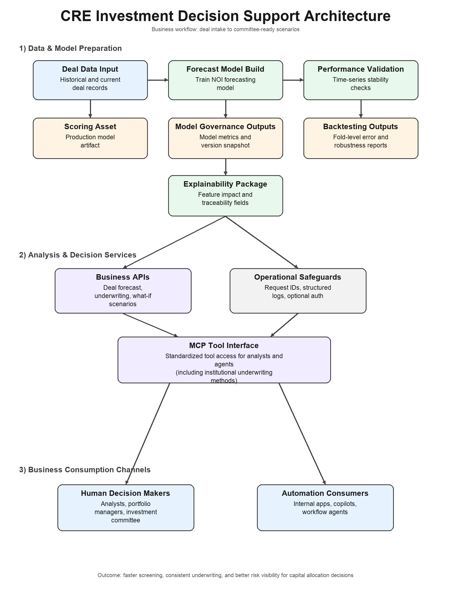

# CRE Underwriting API

## Architecture at a glance

This project is built as a production-oriented **decision-support service** for CRE underwriting, using a supervised learning + deterministic finance-engine architecture.

### Core technologies and framework
- **Python + FastAPI**: low-latency API serving, typed contracts, and operational simplicity.
- **Pydantic models**: strict request/response validation and backward-compatible API evolution.
- **pandas + scikit-learn**: tabular ML pipelines with time-aware data handling and explainability support.
- **joblib model artifacts**: reproducible model serialization for local and container runs.
- **Deterministic underwriting engines** (`underwrite`, `underwrite_inst`, `whatif`, `whatif_inst`):
  transparent, auditable financial mechanics layered on top of ML predictions.
- **Explainability + traceability artifacts**: permutation importance, optional Ridge coefficients,
  dataset hash, model version, and training timestamp.
- **MCP service layer** (`src/mcp_service.py`): tool-based integration surface for agents and institutional workflows.
- **Docker + CI + pytest/smoke scripts**: reproducible build/test/deploy pipeline with API and container health checks.

### Why this implementation is better than a traditional RL approach (for this use case)
- **Problem fit**: current task is primarily forecast + underwriting analysis from historical snapshots,
  not sequential online control where RL is strongest.
- **Data efficiency**: supervised models train effectively on available labeled deal data; RL usually needs far
  more interaction data or high-fidelity simulators.
- **Auditability and governance**: deterministic finance outputs + feature-based explainability are easier to
  review in institutional credit processes than policy-learning behaviors.
- **Stability and reproducibility**: supervised pipelines with fixed splits/metrics are generally more stable across
  retrains; RL training can be more sensitive to reward shaping and environment assumptions.
- **Operational risk control**: guardrails, schema validation, and explicit constraints are straightforward in this architecture.
- **Time-to-value**: this design ships faster and is easier to maintain for underwriting teams while still supporting
  future extension into RL if a robust sequential decision environment is later introduced.

### RL vs traditional ML (business-friendly view)
- **Traditional ML (what this project uses today)**:
  The model learns from past deals to make a forecast, similar to how an analyst uses historical comps and trends.
  In this project, ML predicts next-12-month NOI, and then deterministic underwriting rules convert that into returns,
  DSCR, debt yield, and what-if scenarios.
- **Reinforcement Learning (RL)**:
  RL is more like training an automated “decision agent” that learns by trial and error over many rounds, based on rewards/penalties.
  This is useful when a system must continuously choose actions in sequence (for example, dynamic bidding or robot control).
- **Why supervised ML is the better business fit here**:
  - easier to explain to credit committees and investment teams
  - easier to audit and validate for model risk/governance
  - faster to deploy with lower operational uncertainty
  - more stable when you have historical deal data but not a realistic simulation environment

### Business value and practical use cases

#### Where this tool helps most
- **Deal screening at scale**:
  Evaluate many opportunities quickly and focus analyst time on the most promising deals.
- **Faster underwriting cycles**:
  Reduce spreadsheet iteration by combining NOI prediction with deterministic underwriting outputs.
- **Scenario planning for investment committees**:
  Use what-if and institutional what-if tools to compare outcomes across cap rates, leverage, rate shocks, occupancy shocks, and capex choices.
- **Portfolio consistency**:
  Apply the same underwriting logic across teams, markets, and deal types to reduce process variance.
- **Explainability for stakeholder trust**:
  Support decisions with feature importance and traceability metadata (model version, training timestamp, dataset hash).

#### Benefits of proper usage
- **Time savings**:
  Accelerates early and mid-stage analysis so teams can review more opportunities without increasing headcount.
- **Higher decision consistency**:
  Standardized logic reduces analyst-to-analyst drift and helps maintain policy discipline.
- **Better risk visibility**:
  Guardrails and stress scenarios make downside exposure clearer before capital is committed.
- **Improved governance**:
  Structured outputs and traceability make internal reviews and audit workflows more efficient.

#### Recommended operating model (business-friendly)
- Treat outputs as **decision support**, not autonomous approvals.
- Use the tool for **first-pass ranking and scenario analysis**; keep final approval with investment/credit committees.
- Review model performance periodically and retrain with updated market/deal data.
- Combine model outputs with local market expertise, borrower quality assessment, and legal/asset-level diligence.

### Architecture diagram


Local, production-oriented framework for experimenting with CRE (commercial real estate) NOI forecasting and underwriting workflows:
- Train a baseline ML model (tabular) to forecast next-12-month NOI.
- Optionally enrich model features with unstructured inputs via TF-IDF
  (`unstructured_text`, `deal_notes`, and document extraction from files).
- Run underwriting / ROI calculations (simple + “institutional-style” v2).
- Run what-if scenario grids (simple + institutional) with guardrails.
- Serve everything via FastAPI for local testing and containerized runs.
- Generate explainability artifacts for API consumption (permutation importance + optional Ridge coefficients + traceability metadata).

> Status: working end-to-end locally (train → validate → explain → serve/API+MCP → smoke tests) and in Docker (mount-model + with-model targets).


## Quick start (local)

### 1) Create venv + install deps
```zsh
python -m venv .venv
source .venv/bin/activate
pip install -r requirements.txt
```

Or use the helper script:
```zsh
./scripts/rebuild_env.sh
```

### 2) Generate (or refresh) local synthetic dataset
```zsh
python -m src.synth_data
```

### 3) Train model + metrics
```zsh
python -m src.train
```

### 4) Generate explainability artifacts
```zsh
python -m src.explain
```

### 5) Start API
Serves on `0.0.0.0:8000`.
```zsh
python -m src
```

### 6) Run smoke tests
```zsh
./scripts/smoke_api.sh
```

Optional focused tests:
```zsh
BASE=http://127.0.0.1:8000 ./scripts/test_whatif_inst.sh
./scripts/test_explainability.sh
pytest -q
```

### Unstructured document support (optional)

The API can accept:
- inline text: `unstructured_text`, `deal_notes`
- document paths: `document_paths` (list of files)

Supported file types:
- text: `.txt`, `.md`, `.csv`, `.json`, `.log`
- documents: `.pdf`, `.docx`
- images (OCR): `.png`, `.jpg`, `.jpeg`, `.tif`, `.tiff`, `.bmp`, `.webp`

For image OCR, install the Tesseract system binary in addition to Python deps.

## Codex-friendly workflow

Use stable command targets so local and automated workflows stay aligned:

```zsh
make setup
make test
make run
make mcp-run
make smoke
make rebuild
make validate-ts
```

If your shell `python3` is not your project venv interpreter, run with:
```zsh
PYTHON=./.venv/bin/python make test
```

Verification levels:

- Fast verify: `make test`
- Full verify:
  1. Start API (`make run`)
  2. Run smoke tests (`make smoke`)
  3. Run walk-forward time-series validation (`make validate-ts`)
  4. If model/explainability logic changed, run:
     - `python -m src.train`
     - `python -m src.explain`

Change protocol:

- API contract changes: run `make test` and `make smoke`
- Training/data/explainability changes: run `make test`, `python -m src.train`, and `python -m src.explain`
- Keep generated artifacts (`models/`, `reports/`, `data/raw/`) out of source-control changes unless explicitly requested


## Docker

Two deployment modes are supported:

### A) Mount model at runtime (`mount-model`)
Build:
```zsh
docker build --target mount-model -t cre-underwriting-api:mount .
```

Run (mount local `models/` into the container):
```zsh
docker run --rm -p 8000:8000 -v "$PWD/models:/app/models" cre-underwriting-api:mount
```

### B) Bake model into the image (`with-model`)
Build:
```zsh
docker build --target with-model -t cre-underwriting-api:with-model .
```

Run:
```zsh
docker run --rm -p 8000:8000 cre-underwriting-api:with-model
```

Or use the helper:
```zsh
./scripts/docker_build_run.sh --type both
./scripts/docker_build_run.sh --type mount-model --run --port 8000
./scripts/docker_build_run.sh --type with-model --run --port 8001
./scripts/docker_build_run.sh --type both --stop
```


## API endpoints (FastAPI)

Base URL: `http://127.0.0.1:8000`

- `GET  /health` — basic health check
- `POST /predict` — predict next-12 NOI
- `POST /predict_features` — predict from a free-form `features` payload (optional ROI if finance fields are present)
- `POST /whatif` — simple what-if scenario grid (price / exit cap variations)
- `POST /underwrite` — simple multi-year underwriting
- `POST /underwrite_inst` — institutional underwriting (v2 knobs)
- `POST /whatif_inst` — institutional what-if scenario grid with validation + guardrails
- `GET  /explainability` — exposes `reports/feature_importance.json` (permutation importance + traceability)

Smoke tests cover the full surface area.


## MCP service

This repository includes an MCP server over **stdio** (no HTTP port required for MCP clients).

### Run the MCP server

```zsh
make mcp-run
# or
python -m src.mcp_service
```

### Prerequisites before connecting clients
- Ensure model/artifacts exist (or run rebuild first):
  - `make rebuild`
- If using custom paths/config, set env vars before launch:
  - `MODEL_PATH`, `EXPLAINABILITY_JSON_PATH`, `DATA_PATH`, etc. (see Runtime config section).

### How clients connect
- Transport: `stdio`
- Protocol: JSON-RPC 2.0 message framing with `Content-Length` headers
- Supported MCP methods:
  - `initialize`
  - `ping`
  - `tools/list`
  - `tools/call`

### Example MCP client command configuration

Use this pattern in MCP-capable clients that accept command-based stdio servers:

```json
{
  "command": "python",
  "args": ["-m", "src.mcp_service"],
  "cwd": "/absolute/path/to/cre-underwriting-api",
  "env": {
    "MODEL_PATH": "models/model.joblib",
    "EXPLAINABILITY_JSON_PATH": "reports/feature_importance.json"
  }
}
```

If you use a local venv interpreter, prefer:

```json
{
  "command": "/absolute/path/to/cre-underwriting-api/.venv/bin/python",
  "args": ["-m", "src.mcp_service"],
  "cwd": "/absolute/path/to/cre-underwriting-api"
}
```

### Tool surface (including institutional)

Supported MCP tools:
- `health`
- `explainability`
- `predict`
- `predict_features`
- `whatif`
- `underwrite`
- `underwrite_inst`
- `whatif_inst`

Institutional methods are first-class MCP tools (`underwrite_inst`, `whatif_inst`) and use the same validation/guardrails as the API layer.

### Protocol examples

`initialize` request:

```zsh
Content-Length: <N>

{"jsonrpc":"2.0","id":1,"method":"initialize","params":{}}
```

`tools/list` request:

```zsh
Content-Length: <N>

{"jsonrpc":"2.0","id":2,"method":"tools/list","params":{}}
```

`tools/call` request (institutional example):

```zsh
Content-Length: <N>

{"jsonrpc":"2.0","id":3,"method":"tools/call","params":{"name":"whatif_inst","arguments":{"deal_id":"DTEST","asof_date":"2024-06-01","property_type":"Industrial","city":"Tampa","state":"FL","zip":"33602","year_built":2008,"gross_leasable_sqft":125000,"units":null,"purchase_price":25000000,"noi_t12":1500000,"occupancy_t12":0.95,"opex_t12":450000,"gross_rent_t12":2200000,"ltv":0.65,"interest_rate":0.062,"amort_years":25,"exit_cap_rate":0.065,"selling_cost_pct":0.02,"hold_years":5,"interest_only_years":1,"rent_growth":0.03,"opex_inflation":0.03,"occupancy_target":0.97,"occupancy_reversion_years":2,"taxes_year1":350000,"insurance_year1":60000,"reassess_taxes":true,"reassessed_tax_rate":0.02,"reassess_year":1,"capex_reserve_per_sqft":0.25,"replacement_capex_per_sqft":0.15,"value_add_capex":{"2":250000},"occupancy_shock_year":2,"occupancy_shock_drop":0.1,"occupancy_recovery_years":2,"rate_shock_year":3,"rate_shock_bps":150,"refi_year":3,"refi_ltv":0.65,"refi_rate":0.06,"refi_amort_years":25,"refi_cost_pct":0.01,"purchase_prices":[24000000,25000000],"exit_cap_rates":[0.0625,0.0675],"max_scenarios":20,"top_n":5,"sort_by":"irr"}}}
```

Successful `tools/call` responses include:
- `content` (text payload)
- `structuredContent` (machine-usable JSON result)
- `isError` (`false` on success)

Invalid inputs return JSON-RPC errors or MCP tool error payloads with details.

Security note:
- MCP stdio calls invoke service logic directly and do not traverse HTTP middleware.
- `AUTH_MODE`/`AUTH_TOKEN` protect FastAPI HTTP endpoints, but not local stdio MCP transport.
- Use OS/process-level controls for local MCP access (user permissions, container isolation, CI secret handling).

### Quick MCP connectivity test client

For a simple local validation of MCP wiring, run:

```zsh
python scripts/mcp_test_client.py
```

Using the project venv explicitly:

```zsh
./.venv/bin/python scripts/mcp_test_client.py --python ./.venv/bin/python
```

The script verifies:
- `initialize`
- `tools/list`
- `tools/call` with `health`


## Generated artifacts (ignored by git)

These outputs are generated locally and should be excluded from version control:

- `data/raw/cre_deals.csv`
- `models/model.joblib`
- `reports/metrics.csv`
- `reports/ts_cv_metrics.csv`
- `reports/ts_cv_summary.csv`
- `reports/ts_cv_folds.json`
- `reports/feature_importance.csv`
- `reports/feature_importance.json`
- `reports/model_snapshot.json`
- `data/metadata/dataset_metadata.json`

To rebuild everything from scratch:
```zsh
./scripts/rebuild_all.sh
```


## Scripts

### `scripts/rebuild_env.sh`
Rebuilds the local Python environment (creates `.venv`, installs dependencies).

```zsh
./scripts/rebuild_env.sh
```

### `scripts/rebuild_all.sh`
One-command rebuild of all generated artifacts (synthetic data, train, validation, explainability, metadata).

```zsh
./scripts/rebuild_all.sh
```

### `scripts/docker_build_run.sh`
Build and (optionally) run Docker images for both deployment modes:
- `mount-model`: container expects `models/` mounted at runtime
- `with-model`: model is baked into the image

Examples:
```zsh
# build both targets
./scripts/docker_build_run.sh --type both

# run mount-model (mounts local models/)
./scripts/docker_build_run.sh --type mount-model --run --port 8000

# run with-model (no volume mount)
./scripts/docker_build_run.sh --type with-model --run --port 8001

# stop both containers
./scripts/docker_build_run.sh --type both --stop
```

### `scripts/smoke_api.sh`
Runs end-to-end checks against a running API:
- health
- predict
- whatif
- underwrite
- underwrite_inst
- whatif_inst

```zsh
./scripts/smoke_api.sh
```

### `scripts/test_whatif_inst.sh`
Focused tests for `/whatif_inst` hardening (happy path + invalid inputs + guardrail).

```zsh
BASE=http://127.0.0.1:8000 ./scripts/test_whatif_inst.sh
```

### `scripts/test_explainability.sh`
Verifies:
- model exists
- `src.explain` runs
- CSV/JSON output schema
- `/explainability` endpoint schema (if present)
- explainability JSON artifact includes traceability fields (`model_version`, `trained_at_utc`, `dataset_hash`)

```zsh
./scripts/test_explainability.sh
```


## Runtime config + ops

Environment-based runtime config:
- network: `HOST`, `PORT`
- logging: `LOG_LEVEL`, `LOG_JSON`
- paths: `DATA_PATH`, `DATASET_METADATA_PATH`, `MODEL_PATH`, `MODEL_SNAPSHOT_PATH`, `REPORTS_DIR`, `EXPLAINABILITY_JSON_PATH`
- validation: `TS_CV_SPLITS`
- auth: `AUTH_MODE` (`none` or `token`), `AUTH_TOKEN`

Behavior:
- Structured JSON request logs are emitted by default.
- Responses include `X-Request-ID`.
- If `AUTH_MODE=token`, all non-`/health` endpoints require `Authorization: Bearer <AUTH_TOKEN>`.

## Sanity + package notes

### `src/sanity.py`
Quick verification of:
- dataset loads
- time-based split behaves as expected
- basic stats print

```zsh
python -m src.sanity
```

### `src/__init__.py`
Keeps `src/` as a proper Python package and may expose a minimal public surface.

Avoid `from src import ...` style imports for internal modules; prefer explicit module imports such as:
```python
from src.data_load import load_cre_csv
```


## Tests

### `tests/test_whatif_exit_cap_default.py`
Regression test: confirms `exit_cap_rate` default/behavior in what-if logic.

### `tests/test_unstructured.py`
Regression tests for unstructured text ingestion helpers (`parse_document_paths`, file extraction, and DataFrame enrichment).

### `tests/test_api_basic.py`
Minimal API behavior tests (prediction happy path, explainability traceability fields, what-if validation failure mode).

Run:
```zsh
pytest -q
```

CI also runs:
- `pytest`
- model train + explainability generation
- Docker smoke check (`docker build` + run + `curl /health`)


## Repository layout (high level)

- `src/`
  - `__main__.py` — `python -m src` entrypoint (Uvicorn)
  - `api.py` — FastAPI app + endpoints
  - `mcp_service.py` — MCP server (JSON-RPC over stdio) exposing baseline + institutional tools
  - `data_load.py` — load + time-based split utilities
  - `synth_data.py` — synthetic CRE dataset generator (`data/raw/cre_deals.csv`)
  - `train.py` — training pipeline (produces `models/model.joblib` + metrics)
  - `validate_ts.py` — time-series CV metrics (walk-forward style)
  - `explain.py` — permutation importance → `reports/feature_importance.*`
  - `config.py` — centralized env-driven runtime settings
  - `dataset_versioning.py` — dataset SHA-256 + metadata generation
  - `logging_utils.py` — JSON logging formatter + bootstrap
  - `unstructured.py` — optional text/document ingestion + normalization helpers
  - `roi.py` — ROI engine / finance helpers
  - `underwrite.py` — simple underwriting model
  - `underwrite_inst.py` — institutional underwriting v2
  - `whatif.py` — simple what-if scenario generation
  - `whatif_inst.py` — institutional what-if with validation + guardrails
  - `sanity.py` — basic sanity checks
- `scripts/`
  - `smoke_api.sh`
  - `test_whatif_inst.sh`
  - `test_explainability.sh`
  - `mcp_test_client.py`
  - `rebuild_env.sh`
  - `rebuild_all.sh`
  - `docker_build_run.sh`
- `tests/`
  - `test_whatif_exit_cap_default.py`
  - `test_unstructured.py`
  - `test_api_basic.py`
  - `test_mcp_service.py`
- `models/` (generated)
- `reports/` (generated)
- `data/raw/` (generated)


## License
MIT License. See `LICENSE`.
